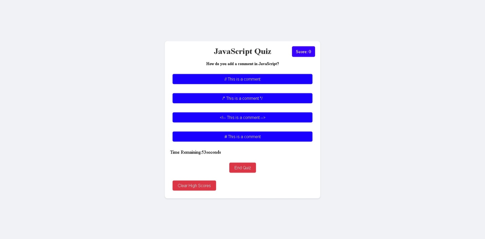
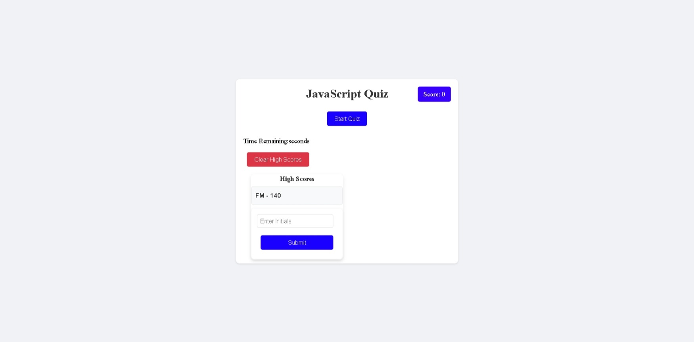

# DOM Web API: JavaScript-web-api-quiz 

## Code Quiz

## User Story Scenario

```
AS A coding boot camp student
I WANT to take a timed quiz on JavaScript fundamentals that stores high scores
SO THAT I can gauge my progress compared to my peers
```

## Application Acceptance Criteria

```
GIVEN I am taking a code quiz
WHEN I click the start button
THEN a timer starts and I am presented with a question
WHEN I answer a question
THEN I am presented with another question
WHEN I answer a question incorrectly
THEN time is subtracted from the clock
WHEN all questions are answered or the timer reaches 0
THEN the game is over
WHEN the game is over
THEN I can save my initials and my score
```

## Mock-Up

The following images preview the application's functionality:





## Links to code Repository and Functioning web Application site: 


 Link to working application: 
 
 https://github.com/fredm23579/JavaScript-web-api-quiz

 Link to GitHub Code Repository: 
 
 https://fredm23579.github.io/JavaScript-web-api-quiz/

